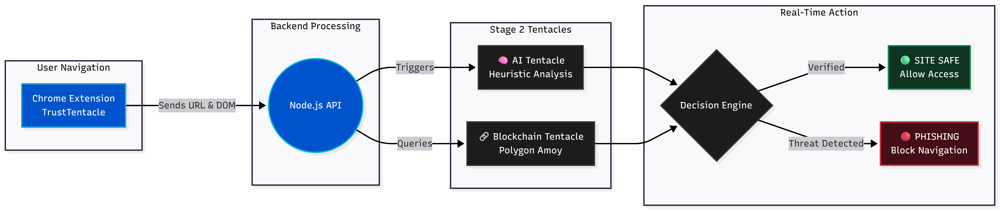
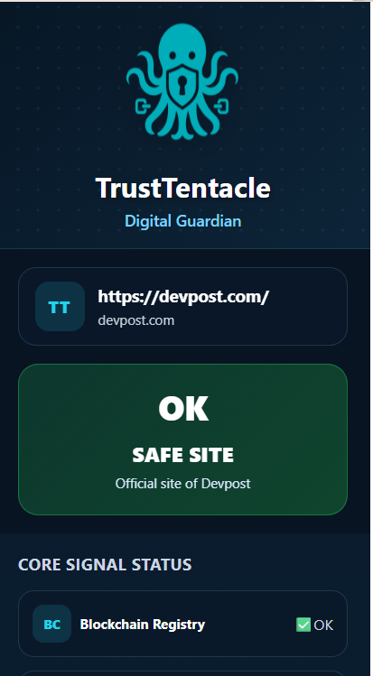
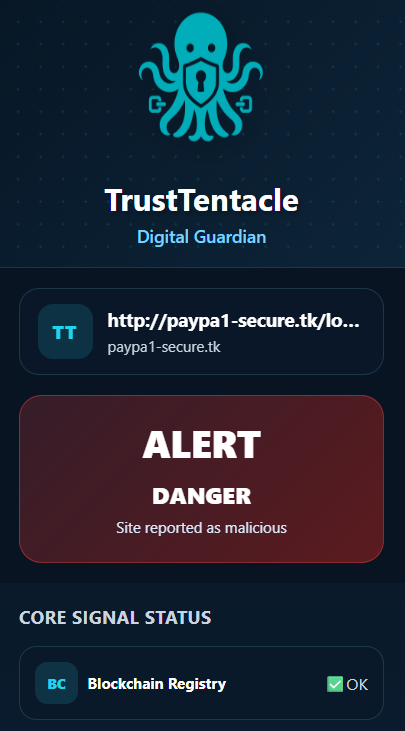
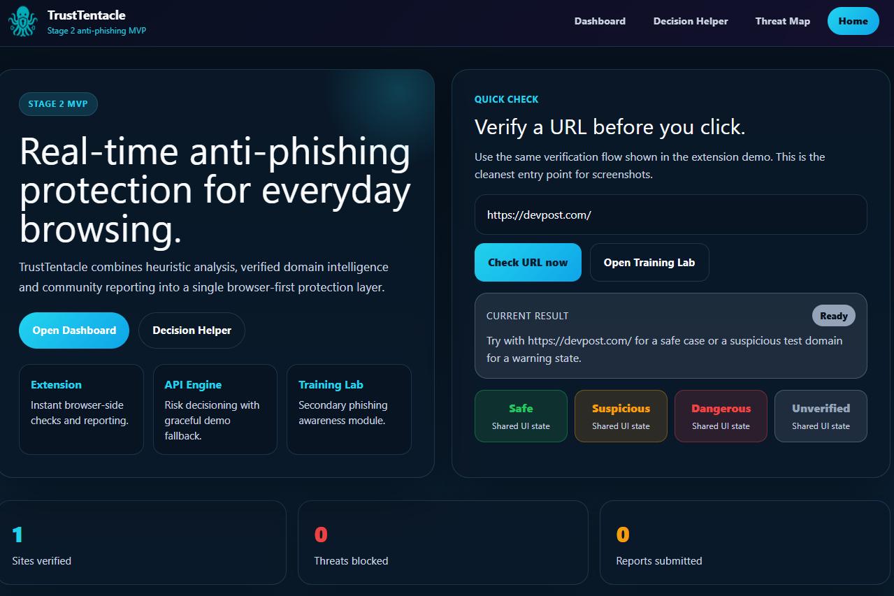
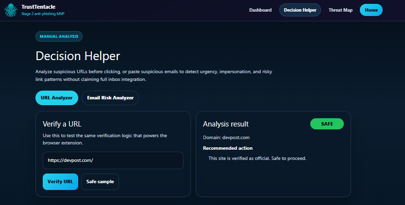
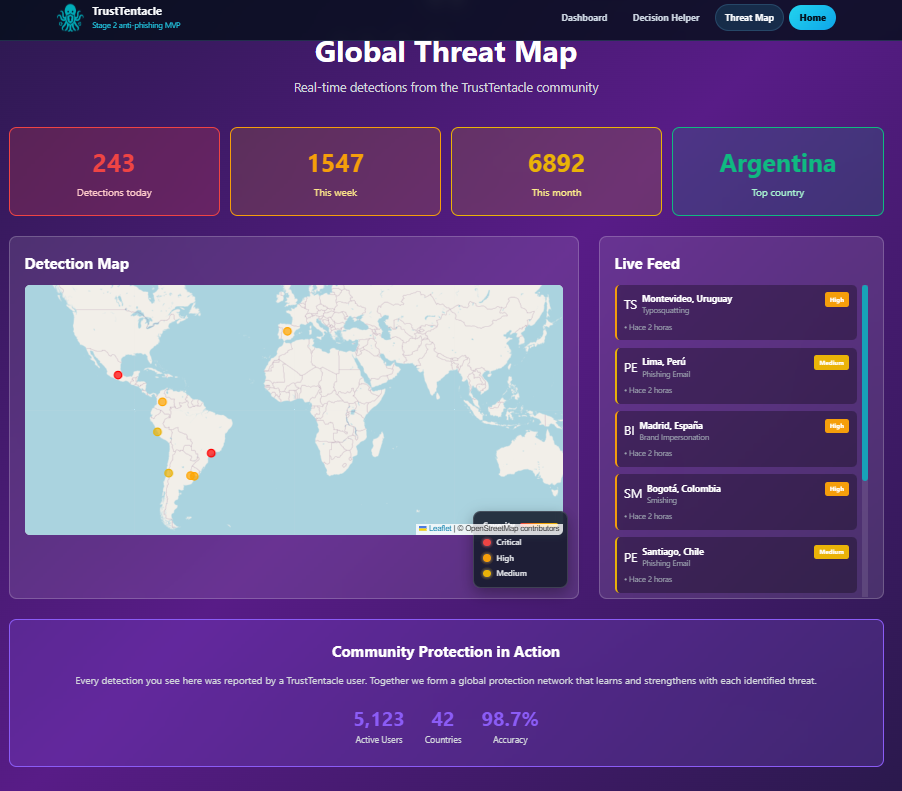

# TrustTentacle

Proactive anti-phishing protection for real-time browsing.

Stage 2 finalist: Top 50 out of 900+ projects in Octopus Hackathon 2025.

## Problem

Phishing, domain impersonation, and social engineering attacks still bypass user awareness and many reactive defenses. Users need a preventive trust layer while they browse, before they submit credentials, connect wallets, or trust a malicious page.

## Solution

TrustTentacle is a browser-first anti-phishing MVP that combines:

- Chrome extension protection for live browsing
- Heuristic risk analysis in a Node.js backend
- Verified domain intelligence for trusted destinations
- Community phishing reporting
- Explainable risk indicators in dangerous flows
- A manual Email Risk Analyzer for suspicious messages
- Dashboard visibility for metrics and recent detections

The repository also includes smart contracts and a blockchain-ready architecture, while the current Stage 2 MVP is optimized for local reliability and a stable live demo.

## Core MVP Scope

Implemented and demo-ready:

- URL verification with `SAFE`, `SUSPICIOUS`, `DANGEROUS`, and `UNVERIFIED` verdicts
- Browser extension popup, automatic checks, and context-menu actions
- Explainable `Risk Indicators` in dangerous site flows
- Community phishing report submission from the extension
- Web dashboard consuming backend activity metrics
- Manual Email Risk Analyzer for suspicious sender, subject, body, and embedded links

Roadmap:

- Expanded threat-intelligence integrations
- Deeper visual and behavioral analysis
- Full production-grade on-chain verification workflows
- Mail client integrations and header validation

## Architecture



Repository structure:

```text
TrustTentacles/
|-- backend/      # Node.js / Express API
|-- contracts/    # Solidity contracts (roadmap-ready)
|-- extension/    # Chrome extension (MV3)
|-- web/          # React / Vite dashboard
|-- docs/         # Architecture and repository media assets
`-- scripts/      # Operational scripts
```

## Screenshots

### Extension Popup

Safe verdict:



Danger verdict:



### Web Dashboard

Dashboard overview:



Decision Helper with URL and email analysis:



Threat Map:



## Quick Start

Prerequisites:

- Node.js 18+
- pnpm
- Chrome or Edge

Install dependencies:

```bash
pnpm install:all
```

Start backend:

```bash
pnpm backend:dev
```

Start web:

```bash
pnpm web:dev
```

Build extension:

```bash
pnpm extension:build
```

Load extension:

1. Open `chrome://extensions/`
2. Enable Developer Mode
3. Click `Load unpacked`
4. Select `extension/dist`

## Environment

Backend:

```bash
cp backend/.env.example backend/.env
```

Contracts:

```bash
cp contracts/.env.example contracts/.env
```

Web:

```bash
cp web/.env.example web/.env
```

Set `VITE_API_BASE_URL` to `http://localhost:3001/api/v1` for local demo.

## Scripts

- `pnpm backend:dev`
- `pnpm web:dev`
- `pnpm extension:build`
- `pnpm demo:start`
- `pnpm demo:check`

## Notes

- The current MVP protects users at browsing time, including phishing links opened from email, SMS, and social engineering channels.
- The manual Email Risk Analyzer is designed for pasted suspicious messages. It is not a Gmail or Outlook inbox integration.
- Blockchain remains part of the architecture and roadmap, but the live demo does not depend on a full on-chain flow.

## License

MIT. See `LICENSE`.
